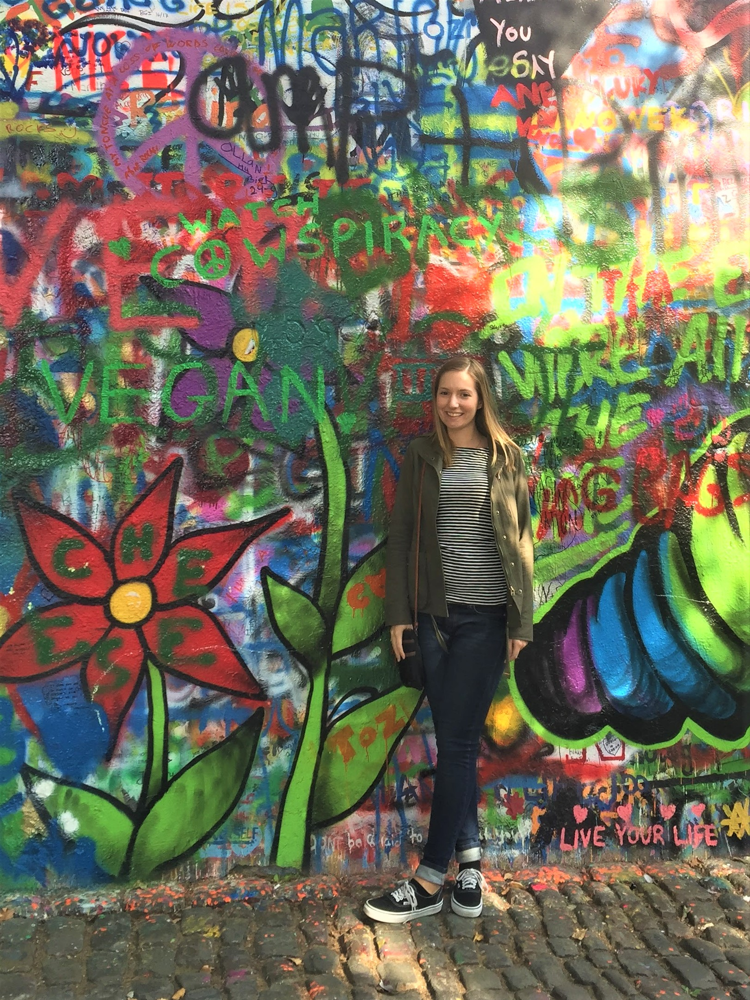

### DrPH Candidate
### Environmental Health Sciences
#### Mailman School of Public Health
#### Columbia University

 
 
Kylie is a first year Doctor of Public Health Student in the [Department of Environmental Health Sciences](https://www.mailman.columbia.edu/academics/departments/environmental-health-sciences-ehs) at [Columbia University](https://www.columbia.edu/). 

 

 

Kylie received a BS in Environmental Science and Technology from [University of Maryland, College Park](https://umd.edu/) in 2012 and an MPH in Environmental Health Sciences from [Mailman School of Public Health](https://www.mailman.columbia.edu/) at Columbia University in 2015.  She has worked at [Columbia Center for Children's Environmental Health](https://ccceh.org/) as a program coordinator since graduation. 

 

### CV

You can find her CV [here](CV.html).

 

### Projects

View a [flexdashboard](flex_dashboard.html) of Instacart data orders from 2017. 

 

#### Contact Information

Kylie Wheelock Riley
 
[Department of Environmental Health Sciences](https://www.mailman.columbia.edu/become-student/departments/environmental-health-sciences-ehs)
 
[Columbia Mailman School of Public Health](https://www.mailman.columbia.edu/)
 
722 West 168th Street
 
New York, New York 10032
 
Email: kmw2189@cumc.columbia.edu